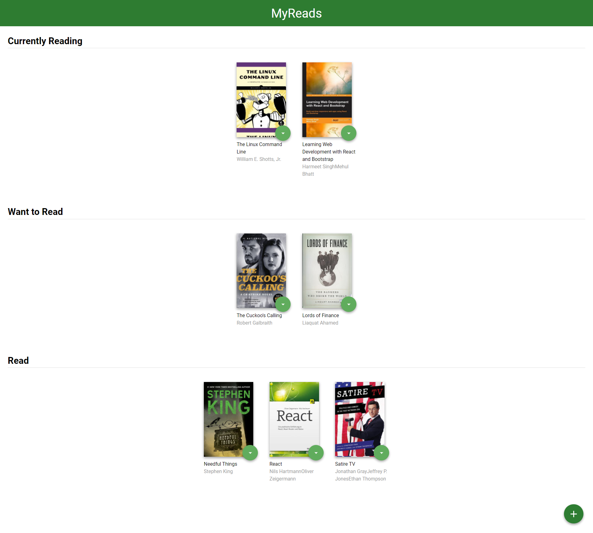
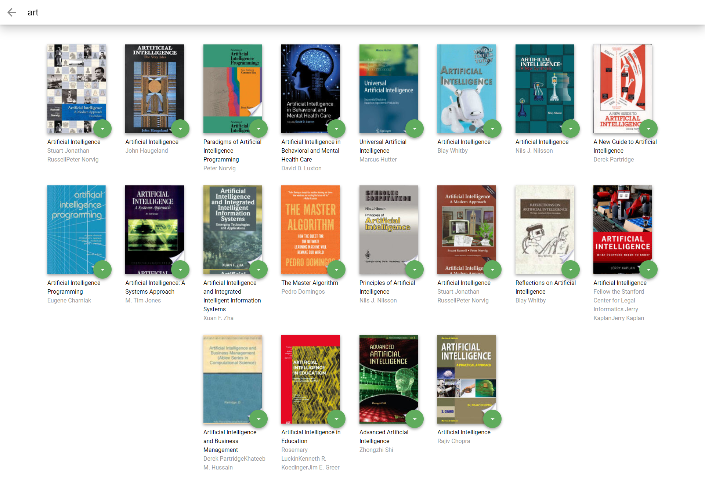

# MyReads Project

This is a bookshelf app that allows you to select and categorize books you have read, are currently reading, or want to read. The project emphasizes using React to build the application and provides an API server and client library that is used to persist information as you interact with the application.

## Home Page View


## Search Page View


## TL;DR

To get started developing right away:

* install all project dependencies with `npm install`
* start the development server with `npm start`

## What You're Getting
```bash
├── README.md - This file.
├── SEARCH_TERMS.md # The whitelisted short collection of available search terms for you to use with your app.
├── package.json # npm package manager file. It's unlikely that you'll need to modify this.
├── public
│   ├── favicon.ico # React Icon, You may change if you wish.
│   └── index.html # DO NOT MODIFY
└── src
    ├── App.css # Styles for your app. Feel free to customize this as you desire.
    ├── App.js # This is the root of the app, Application route's are configured here
   	├── Book.js # Defines a common book structure and functionality
    ├── BookShelf.js # Defines a common bookshelf structure
    ├── Constants.js # Holds global constants
    ├── MyReads.js # Main page, displayes Currentltt reading, want to read, read bookshelves
    ├── SearchBooks
    │	├── SearchBooks.js # Parent component for the search page, Holds state that is shared by child components.
    │	├── SearchBar.js # First child of SearchBooks, Allows users to enter search text(query)
    │	├── FilterBooks.js # Second child of SearchBooks, Displays books based on user entered search Text in searchBar
    ├── App.test.js # Used for testing. Provided with Create React App. Testing is encouraged, but not required.
    ├── BooksAPI.js # A JavaScript API for the provided Udacity backend. Instructions for the methods are below.
    ├── icons # Helpful images for your app. Use at your discretion.
    │   ├── add.svg
    │   ├── arrow-back.svg
    │   └── arrow-drop-down.svg
    ├── index.css # Global styles. You probably won't need to change anything here.
    └── index.js # You should not need to modify this file. It is used for DOM rendering only.
```


## Backend Server

This app uses udacity provided backend server to develop. App uses the methods provided in file [`BooksAPI.js`](src/BooksAPI.js) to perform necessary operations on the backend:

### App Functionality
In this application, the main page displays a list of "shelves" (i.e. categories), each of which contains a number of books. The three shelves are:

  * Currently Reading
  * Want to Read
  * Read

Each book has a control that lets you select the shelf for that book. When you select a different shelf, the book moves there. Note that the default value for the control should always be the current shelf the book is in.

The main page also has a link to /search, a search page that allows you to find books to add to your library.

The search page has a text input that may be used to find books. As the value of the text input changes, the books that match that query are displayed on the page, along with a control that lets you add the book to your library

When a book is on a bookshelf, it will have the same state on both the main application page and the search page.

When a book is on a bookshelf, it should have the same state on both the main application page and the search page.

## Create React App

This project was bootstrapped with [Create React App](https://github.com/facebookincubator/create-react-app). You can find more information on how to perform common tasks [here](https://github.com/facebookincubator/create-react-app/blob/master/packages/react-scripts/template/README.md).
